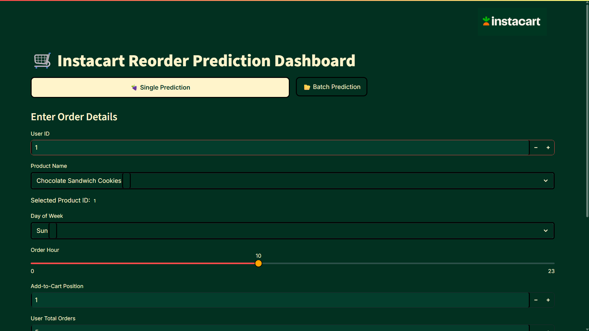
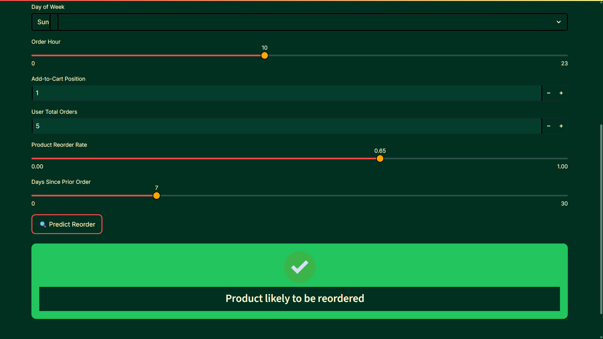
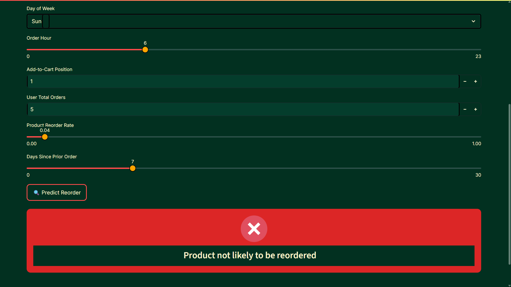
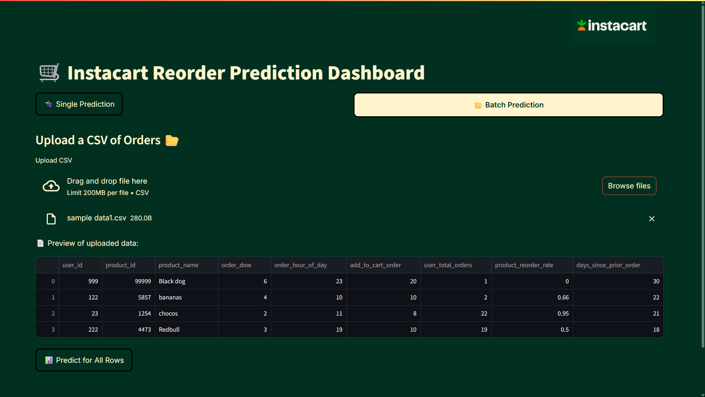
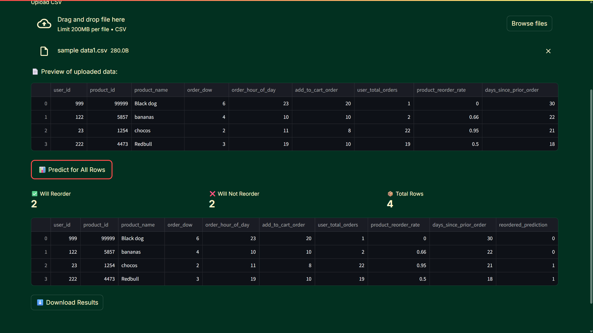

# 🧠 Capstone Project – Instacart Market Basket Analysis

## 👤 Author

**Sumit Maradi**  
LP Batch A - 2025

---

# 🛒 Instacart Reorder Prediction Dashboard

This is a **Streamlit-based machine learning web application** that predicts whether a product will be reordered by a customer on Instacart.  
The dashboard supports both **single prediction** and **batch CSV uploads**.

---

## 🚀 Features

- 🎯 **Single Prediction**: Input features manually and get real-time reorder prediction.
- 📂 **Batch Prediction**: Upload a CSV file of multiple orders and predict reorder outcomes in bulk.
- 📊 **Visual Feedback**: Metrics showing how many products will be reordered or not.
- 🧠 **Model Insights**: Trained with historical Instacart order data, including user behavior and product popularity.

---

## 🧪 Tech Stack

- **Frontend:** Streamlit
- **Backend:** Python, scikit-learn
- **Model:** Classification using Decision Tree / Random Forest
- **Data:** Instacart Online Grocery Basket Analysis  
  [🔗 Kaggle Dataset](https://www.kaggle.com/datasets/yasserh/instacart-online-grocery-basket-analysis-dataset)

---

## 🧾 Input Features

| Feature Name             | Description                                       |
| ------------------------ | ------------------------------------------------- |
| `user_id`                | Unique ID representing the user                   |
| `product_id`             | Unique ID for the product                         |
| `product_name`           | Product name (used only for display)              |
| `order_dow`              | Day of the week the order was placed (0 = Sunday) |
| `order_hour_of_day`      | Hour of the day the order was placed (0 to 23)    |
| `add_to_cart_order`      | Position of the product in the shopping cart      |
| `user_total_orders`      | Total number of orders placed by the user         |
| `product_reorder_rate`   | How frequently the product was reordered          |
| `days_since_prior_order` | Days since the user's last order                  |

---

## ⚙️ How to Run Locally

### 📦 Setup Instructions

1. **Clone the repository or download the folder**  
   Ensure the following files are in the same directory:

   - `app.py`
   - `model.joblib`
   - `instacart_logo.png`
   - `requirements.txt`

2. **Install dependencies**
   ```bash
   pip install -r requirements.txt
   ```

## 3.**Create and activate virtual environment**

python -m venv venv
venv\\Scripts\\activate # Windows
source venv/bin/activate # macOS/Linux

## 4.(Optional) Train the model

python main.py

## 5.Run the Streamlit app

streamlit run app.py

## 📁 Project Structure

sumitmaradi_capstoneproject/
├── app.py # Streamlit frontend
├── model.joblib # Trained ML model
├── main.py # (Optional) Model training script
├── setup_db.py # (Optional) Script to set up local SQLite DB
├── instacart.db # (Optional) SQLite database file
├── requirements.txt # Python dependencies
├── instacart_logo.png # Logo displayed in the dashboard
├── preview1.png # Screenshot 1 for README
├── preview2.png # Screenshot 2 for README
├── preview3.png # Screenshot 3 for README
├── preview4.png # Screenshot 4 for README
├── preview5.png # Screenshot 5 for README

├── data/ # Raw and processed data files
│ ├── aisles.csv
│ ├── departments.csv
│ ├── order_products\_\_train.csv
│ ├── orders.csv
│ └── products.csv

├── pipeline/ # Feature engineering and training logic
│ ├── preprocessing.py # Data cleaning & transformation steps
│ └── training.py # ML model training pipeline

├── utils/ # Utility scripts
│ └── db_import.py # (Optional) DB import logic

├── artifacts/ # Saved artifacts
│ ├── cleaned_data.csv # Cleaned dataset after preprocessing
│ ├── confusion_matrix.png # Visualized confusion matrix
│ └── model.joblib # Final trained model

## 📷 Screenshot

<br>






<br>

### ✅ Summary of Improvements:

- ✅ **Fixed grammar and consistency** (e.g., “setup” → “Setup”, “run” → “Run”).
- ✅ **Added code block formatting** for clear CLI commands and Python snippets.
- ✅ **Improved directory tree structure** using proper markdown indentation.
- ✅ **Added missing files** such as `pipeline/training.py` to the project structure.
- ✅ **Removed unnecessary HTML tags** like `<br>` for cleaner markdown rendering.
- ✅ **Clarified optional components** with inline comments (e.g., database, training).

## 📝 License

This project is for academic and demonstration purposes only.
Dataset © Instacart via Kaggle.
